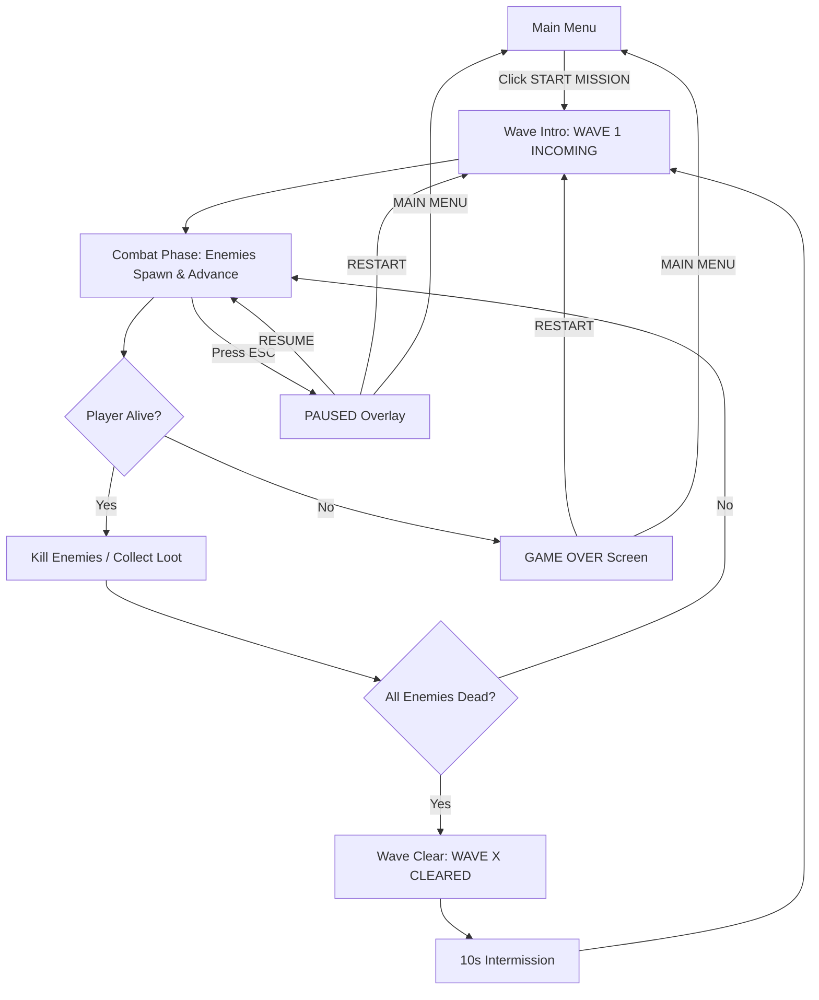
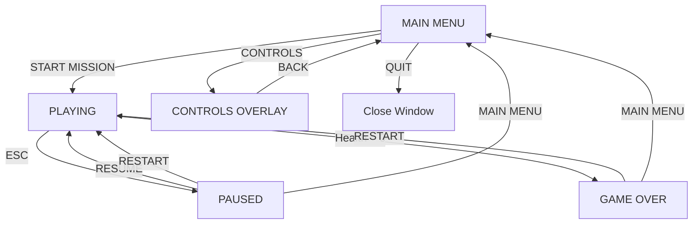

# FPS Strike Survival — Product Design Document

## 1. Product Vision & Executive Summary

### Elevator Pitch
**FPS Strike Survival** is a first-person modern shooter where the player is dropped into a procedurally-built, richly detailed urban battlefield and must survive endless waves of AI enemies. Built entirely with TypeScript, Vite, and THREE.js, every 3D model is constructed from primitive geometries with procedural materials — no external binary assets. The game combines the tension of tower-defense survival with the tactical depth of a modern FPS: cover-based combat, weapon management, and escalating enemy pressure.

### Core Design Goals & Value Proposition
1. **Realistic, Immersive Environments:** Visually rich street maps with realistic lighting (directional sun, ambient occlusion, shadows), detailed props (buildings, cars, containers), and tactical cover placement.
2. **Tactical Combat Depth:** 6 distinct weapons with unique handling, 6 enemy types with distinct AI behaviors, and a cover-based combat loop that rewards positioning and resource management.
3. **Endless Survival Tension:** Wave-based tower defense where enemies spawn from map edges, advance intelligently, and escalate in difficulty — creating a "one more wave" compulsion loop.
4. **Zero External Assets:** All geometry from THREE.js primitives (boxes, cylinders, spheres), all textures from procedural canvas materials. Fully self-contained, instantly runnable.

---

## 2. Core User Journey & Primary Workflow

### Core Loop Diagram

### Primary User Stories
- **As a player**, I want to move with WASD and look with the mouse, so that I can navigate the map and position myself behind cover.
- **As a player**, I want to left-click to shoot and right-click to aim down sights, so that I can engage enemies accurately.
- **As a player**, I want to press R to reload, so that I can keep my weapon operational during prolonged firefights.
- **As a player**, I want to hold Shift to sprint and press Space to jump, so that I can reposition quickly and dodge incoming fire.
- **As a player**, I want to press G to throw a grenade, so that I can clear groups of enemies behind cover.
- **As a player**, I want to scroll or press number keys to switch weapons, so that I can adapt to different combat ranges.
- **As a player**, I want to right-click with the sniper rifle and scroll to zoom in/out, so that I can engage distant targets with precision.
- **As a player**, I want to survive waves of enemies that spawn from map edges, so that I can experience escalating survival tension.
- **As a player**, I want to pick up weapon and ammo drops from kills, so that I can sustain my arsenal without running dry.

---

## 3. Functional Feature Breakdown

### 3.1 Feature Domain: Player Controls & Movement

| Control | Action | Details |
|---------|--------|---------|
| **W / A / S / D** | Move forward / left / backward / right | Relative to camera direction. Speed: 5 m/s (walk). |
| **Mouse Move** | Look around | Yaw (horizontal) + Pitch (vertical). Sensitivity: configurable (default 0.002). |
| **Left Click** | Shoot | Fires current weapon. Auto-fire for automatic weapons. |
| **Right Click (Hold)** | Aim Down Sights (ADS) | Reduces spread, increases zoom (1.5x for most weapons). |
| **R** | Reload | Starts reload animation. Cannot shoot while reloading. |
| **Shift (Hold)** | Sprint | Speed: 8 m/s. Cannot shoot or ADS while sprinting. FOV widens slightly. |
| **Space** | Jump | Vertical impulse. Gravity: 20 m/s². |
| **G** | Throw Grenade | Throws a grenade from current position with forward velocity. |
| **Scroll Wheel** | Switch Weapon | Cycles through inventory. |
| **1–6** | Direct Weapon Select | Switches to specific weapon slot. |
| **Esc** | Pause / Resume | Toggles pause overlay. |

**Movement Rules:**
- Player collides with map geometry (buildings, walls, crates, vehicles) using AABB collision.
- Sprinting cannot be initiated while ADS or shooting.
- Jumping is disabled while sprinting (sprint must be released first).
- Player has a health pool of **100 HP**. No health regeneration (except via pickup — see Loot System).

### 3.2 Feature Domain: Weapons & Combat

#### Weapon Specifications (6 Weapons)

| # | Name | Type | Damage | Fire Rate (RPM) | Mag Size | Reserve Ammo | Reload Time (s) | Effective Range (m) | Spread (ADS / Hip) | Zoom | Move Speed Modifier | Special Behavior |
|---|------|------|--------|-----------------|----------|---------------|-----------------|---------------------|--------------------|------|---------------------|------------------|
| 1 | **M9 Pistol** | Pistol | 25 | 300 (semi) | 12 | 48 | 1.2 | 20 | 0.01 / 0.05 | 1.2x | 1.0 | Infinite reserve (replenishes slowly over time) |
| 2 | **AK-47** | Assault Rifle | 34 | 600 (auto) | 30 | 120 | 2.5 | 50 | 0.02 / 0.08 | 1.5x | 0.9 | Medium recoil, reliable all-rounder |
| 3 | **MP5** | SMG | 18 | 900 (auto) | 30 | 120 | 2.0 | 25 | 0.03 / 0.10 | 1.5x | 1.0 | High fire rate, low damage, good for close range |
| 4 | **M870 Shotgun** | Shotgun | 12×8 pellets | 60 (semi) | 6 | 24 | 3.0 | 15 | 0.05 / 0.15 | 1.3x | 0.85 | Spread of 8 pellets per shot; devastating at close range |
| 5 | **AWM Sniper** | Sniper Rifle | 120 | 40 (semi) | 5 | 20 | 3.5 | 100+ | 0.0 / 0.02 | 2x / 4x / 8x (scroll) | 0.7 | Variable zoom; scope overlay when ADS; one-shot kill on headshot |
| 6 | **M249 LMG** | Light Machine Gun | 28 | 750 (auto) | 100 | 200 | 5.0 | 40 | 0.04 / 0.12 | 1.5x | 0.6 | High capacity, sustained fire; slow movement while firing |

**Weapon Behavior Rules:**
- **ADS (Right-Click):** Reduces spread by 60–75% (per weapon table). Movement speed reduced by 20% while ADS.
- **Recoil:** Each shot adds upward camera pitch. Recoil resets over time when not firing.
- **Reloading:** Cannot shoot, sprint, or switch weapons during reload. Reload is interrupted by switching weapons.
- **Ammo:** Each weapon has magazine + reserve. When reserve is empty, weapon cannot fire until ammo pickup is collected.
- **Weapon Switching:** Takes 0.5s to switch. Cannot shoot during switch animation.
- **Grenades:** Player carries 3 grenades. Press G to throw. Explosion radius: 5m, damage: 100 (falloff). Grenades are replenished on wave clear (reset to 3).

### 3.3 Feature Domain: Enemy AI (6 Enemy Types)

| # | Name | Appearance | Health | Speed (m/s) | Damage | Attack Behavior | Movement Behavior | Distance Keeping | Special Ability |
|---|------|------------|--------|-------------|--------|-----------------|-------------------|------------------|-----------------|
| 1 | **Grunt** | Humanoid, gray uniform, standard rifle | 50 | 3.5 | 8 | Single-shot rifle fire at 10m range | Advances toward player, stops at 10m to shoot | Maintains 8–12m distance | None |
| 2 | **Rusher** | Humanoid, red bandana, knife | 30 | 6.0 | 15 (melee) | Melee attack when within 2m | Charges directly at player, ignores cover | None (closes distance) | Fast, erratic zigzag movement |
| 3 | **Shooter** | Humanoid, dark armor, SMG | 60 | 4.0 | 10 | Burst fire (3-round) at 15m range | Advances, takes cover behind objects, peeks to shoot | Maintains 12–18m distance | Takes cover when reloading |
| 4 | **Tank** | Large humanoid, heavy armor, minigun | 200 | 2.0 | 20 | Sustained minigun fire at 20m range | Slow advance, cannot take cover | Maintains 15–20m distance | High health; slow but devastating |
| 5 | **Sniper** | Humanoid, ghillie suit, sniper rifle | 40 | 2.5 | 50 | Single high-damage shot at 40m+ range | Stays at long range, rarely moves | Maintains 30–50m distance | Long-range accuracy; telegraphed laser sight before firing |
| 6 | **Suicide Bomber** | Humanoid, vest with blinking red light | 25 | 5.0 | 100 (explosion) | Explodes when within 3m of player | Charges directly at player | None (closes distance) | Explodes on death (5m radius); beeping sound intensifies as it approaches |

**Enemy AI Rules:**
- All enemies spawn at random points along map edges (outside player's view).
- Enemies advance toward the player's current position using simple pathfinding (raycast + AABB collision avoidance).
- Enemies stop at their preferred engagement distance and shoot. They strafe laterally while shooting.
- Enemies take cover behind map objects when not actively shooting (Shooter type).
- Enemies cannot damage each other.
- Enemy accuracy decreases with distance (spread increases).

### 3.4 Feature Domain: Maps (3 Maps)

| Map | Theme | Layout Description | Cover Placement |
|-----|-------|-------------------|-----------------|
| **Town Street** | Realistic urban street | Central road flanked by 2–3 story buildings, parked cars, street lamps, sidewalks, alleyways | Parked cars (low cover), concrete barriers, building corners, dumpsters, planters |
| **Desert Ruins** | Open sandy area with ancient ruins | Flat sandy terrain with ruined stone walls, broken pillars, collapsed arches, scattered rubble | Ruined wall segments (half-height), pillars (full-height), rubble piles (low cover), archways |
| **Cargo Dock** | Industrial shipping port | Large concrete dock with stacked shipping containers, cranes, wooden crates, forklifts | Shipping containers (full-height, arranged in corridors), wooden crates (low cover), crane legs (partial cover), stacked pallets |

**Map Rules:**
- Each map is approximately 100m × 100m.
- Maps are enclosed by invisible walls (player cannot leave the play area).
- Enemy spawn points are distributed along all four edges of the map.
- Lighting: Directional sun light (warm tone for Town Street, harsh bright for Desert Ruins, cool industrial for Cargo Dock) + ambient light + shadow casting.

### 3.5 Feature Domain: Tower Defense Survival Mode

**Wave System:**
- Game starts at **Wave 1**.
- Each wave has a fixed enemy count: `Wave N` = `5 + (N × 3)` enemies.
- Enemy composition scales with wave number:
  - **Wave 1–3:** Grunts only.
  - **Wave 4–6:** Grunts + Rushers.
  - **Wave 7–9:** Grunts + Rushers + Shooters.
  - **Wave 10–12:** + Tanks.
  - **Wave 13–15:** + Snipers.
  - **Wave 16+:** + Suicide Bombers. All enemy health +10% per wave beyond 15.
- Enemies spawn in groups of 3–5 at random edge points, staggered over the wave duration.
- **Wave Clear:** When all enemies are dead, "WAVE X CLEARED" appears. 10-second intermission before next wave.
- **Difficulty Scaling:** Enemy health increases +5% per wave. Enemy damage increases +2% per wave.

**Player Stats:**
- **Health:** 100 HP. No regen.
- **Kill Count:** Tracked and displayed on HUD.
- **Wave Number:** Tracked and displayed on HUD.

**Win/Lose Condition:**
- **Lose:** Player health reaches 0 → "GAME OVER" screen.
- **Win:** No explicit win condition — endless survival. Game continues until player dies.

### 3.6 Feature Domain: Loot System

**Drop Rules:**
- Every enemy kill has a **25% chance** to drop a loot pickup.
- Drop type distribution:
  - **60% Ammo Crate:** Restores 30% of reserve ammo for all weapons.
  - **40% Weapon Drop:** Spawns a random weapon (weighted toward weapons the player doesn't currently hold).
- Loot pickups appear as glowing floating crates (ammo = green glow, weapon = blue glow).
- Pickup radius: 2m. Player walks over to collect.
- **Weapon Pickup Behavior:** If player already has the weapon, it converts to ammo instead. If inventory is full (6 weapons), the pickup is ignored (cannot pick up).
- **Ammo Pickup Behavior:** Instantly adds ammo to all weapons' reserve pools.

### 3.7 Feature Domain: Feedback Systems & View States

| System | Description |
|--------|-------------|
| **Crosshair** | Dynamic crosshair: expands with movement/firing, contracts when ADS. Color: white (default), red (enemy in crosshair). |
| **Hit Marker** | Small white X appears at crosshair for 0.2s on enemy hit. Red X on kill. |
| **Damage Indicator** | Red vignette flash on screen edge from direction of incoming damage. |
| **Low Health Warning** | Persistent red vignette when health < 30%. |
| **Muzzle Flash** | Brief point light + sprite flash at weapon muzzle on each shot. |
| **Screen Shake** | Small shake on shooting, larger shake on grenade explosion. |
| **Weapon Bob** | Subtle camera bob while walking; increased while sprinting. |
| **Kill Popup** | "+100" score text floats up from kill location. |
| **Enemy Death** | Enemy falls over (rotation animation) or explodes (Suicide Bomber) with particle burst. |
| **Grenade Explosion** | Particle burst + screen shake + brief flash. |

---

## 4. UX / UI Navigation & Screen State Flow

### Screen Flow Diagram

### UI Screens & Exact Strings

#### Main Menu
- Title: **FPS STRIKE SURVIVAL**
- Buttons:
  - **START MISSION**
  - **CONTROLS**
  - **QUIT**
- Footer: "v1.0 — Procedural FPS Survival"

#### Controls Overlay
- Title: **CONTROLS**
- Content:
  - **WASD** — Move
  - **Mouse** — Look
  - **Left Click** — Shoot
  - **Right Click** — Aim
  - **R** — Reload
  - **Shift** — Sprint
  - **Space** — Jump
  - **G** — Throw Grenade
  - **Scroll / 1-6** — Switch Weapon
  - **ESC** — Pause
- Button: **BACK**

#### HUD (During Gameplay)
- **Top Left:** `WAVE 3` | `KILLS: 12`
- **Bottom Left:** Health bar with number: `HP 75/100`
- **Bottom Right:** Weapon info:
  - Weapon name: `AK-47`
  - Ammo: `24 / 120`
  - Grenades: `GRENADES: 2`
- **Center:** Crosshair (dynamic)
- **Top Center (transient):** Wave announcements (see below)

#### Wave Announcements
- Wave start: **WAVE 1 INCOMING** (3s display)
- Wave clear: **WAVE 1 CLEARED** (3s display)
- Intermission: **NEXT WAVE IN 10s** (countdown)

#### Pause Menu
- Title: **PAUSED**
- Buttons:
  - **RESUME**
  - **RESTART**
  - **MAIN MENU**

#### Game Over Screen
- Title: **GAME OVER**
- Stats:
  - **WAVES SURVIVED: 5**
  - **TOTAL KILLS: 23**
- Buttons:
  - **RESTART**
  - **MAIN MENU**

#### Interaction Prompts (Pickup)
- When near ammo crate: **PRESS E TO PICK UP AMMO**
- When near weapon drop: **PRESS E TO PICK UP [WEAPON NAME]**
- When inventory full: **INVENTORY FULL**

#### Reload Prompt
- When magazine empty: **PRESS R TO RELOAD** (flashing)

---

## 5. Visual Polish Standards

### Lighting
- **Directional Sun Light:** Primary light source with shadow casting. Color varies by map (warm #FFD9A0 for Town, harsh #FFF5E0 for Desert, cool #C0D8FF for Dock).
- **Ambient Light:** Soft fill light (intensity 0.3–0.5).
- **Hemisphere Light:** Sky/ground gradient for natural ambient occlusion feel.
- **Shadows:** Enabled on all major geometry. Shadow map size: 2048×2048.
- **Emissive Materials:** Street lamps, building windows (Town), warning lights (Dock), glowing crystals (Desert).

### Environment Detail
- **Procedural Textures:** All textures generated via canvas (noise, gradients, patterns). Examples:
  - Asphalt: dark gray noise with cracks.
  - Concrete: light gray noise with stains.
  - Brick: repeating brick pattern with color variation.
  - Sand: tan noise with ripples.
  - Metal: brushed metal gradient with rust spots.
- **Props:** Buildings (boxes with window planes), cars (box + cylinder wheels), containers (box with corrugated texture), crates (box with wood texture), street lamps (cylinder + sphere), pillars (cylinder), cranes (box + cylinder structure).
- **Skybox:** Procedural gradient sky (blue to horizon) with sun disc. Changes color per map.

### Procedural Model Construction Standards
- All models composed of THREE.js primitives: `BoxGeometry`, `CylinderGeometry`, `SphereGeometry`, `PlaneGeometry`, `ConeGeometry`.
- Materials: `MeshStandardMaterial` with procedural canvas textures or `MeshPhongMaterial` for simpler surfaces.
- No external geometry files (.glb, .obj, .fbx).
- No external texture files (.png, .jpg).
- All textures generated at runtime via `CanvasTexture`.

### Performance Targets
- Target: 60 FPS on mid-range hardware.
- Draw calls: < 500 per frame.
- Triangle count: < 500K per frame.
- Use frustum culling and simple LOD (distance-based detail reduction for props).

---

## 6. Scope Boundaries & Constraints

### In-Scope (v1 Release)
- Single-player FPS with tower defense survival mode.
- 3 maps: Town Street, Desert Ruins, Cargo Dock.
- 6 weapons: M9 Pistol, AK-47, MP5, M870 Shotgun, AWM Sniper, M249 LMG.
- 6 enemy types: Grunt, Rusher, Shooter, Tank, Sniper, Suicide Bomber.
- Player mechanics: WASD movement, mouse look, shoot, ADS, reload, sprint, jump, grenade, sniper zoom, weapon switching, inventory.
- Wave-based survival with escalating difficulty.
- Loot drops (weapons + ammo) from kills.
- HUD, main menu, pause menu, game over screen, controls overlay.
- Procedural 3D models and textures (no external binary assets).
- Realistic lighting with shadows.
- Cover-based map design.

### Out-of-Scope (Strict Non-Goals)
- **NO external binary assets:** No .glb, .obj, .png, .jpg, .mp3, .wav files. All geometry and textures must be procedural.
- **NO multiplayer / networking:** Single-player only. No online features, no co-op, no PvP.
- **NO backend / accounts / cloud saves:** No authentication, no server-side persistence.
- **NO audio files:** If audio is desired, it must be procedurally generated via WebAudio API (oscillators, noise). No pre-recorded audio assets.
- **NO physics engine:** No external physics library (e.g., cannon.js, ammo.js). Use simple custom AABB collision.
- **NO UI framework:** No React, Vue, or other UI libraries. Use plain HTML/CSS overlay for HUD.
- **NO additional build tools:** Only Vite + TypeScript + THREE.js. No extra bundlers, transpilers, or plugins beyond standard Vite setup.
- **NO level editor / map creation tools:** Maps are hardcoded in code.
- **NO save/load game state:** Game state resets on restart.
- **NO difficulty selection:** Difficulty scales automatically with wave number.
- **NO weapon customization / attachments:** Weapons are fixed with no mods.
- **NO vehicle gameplay:** No drivable vehicles.
- **NO destructible environments:** Buildings and props are static.
- **NO story / narrative:** No campaign, no dialogue, no cutscenes.